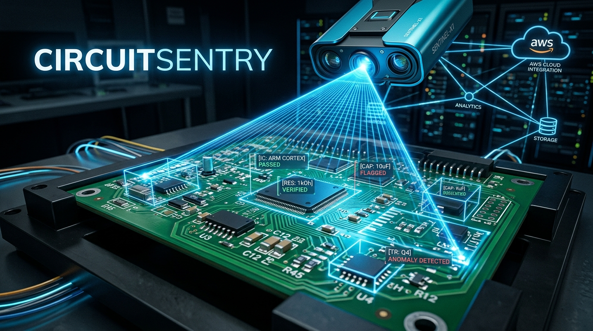

# CircuitSentry — Agentic PCB Visual Inspection



## Overview
CircuitSentry is a low-cost, cloud-powered automated optical inspection (AOI) system for Printed Circuit Boards (PCBs). Designed for hobbyist electronics makers, small-batch PCB assemblers, and educational labs, it brings the power of agentic vision to users who cannot afford dedicated commercial AOI hardware.

Rather than relying on a one-shot classifier, CircuitSentry operates as an intelligent agent. Using a standard laptop webcam and AWS cloud services, it inspects a board and decides its next action based on real-time observations:
- **Pass**: If the board looks clean with high confidence.
- **Inspect Closer**: If a region is ambiguous, the system requests a re-capture with a tighter ROI/zoom.
- **Escalate**: If a defect is found with high confidence, it flags the issue for human review.

This agentic loop is orchestrated via AWS Step Functions, ensuring a robust perception → decision → action workflow.

## Features
- **Agentic Vision Workflow**: Implements a true agentic loop where vision results dictate subsequent actions (e.g., re-capturing ambiguous regions).
- **Explainable Classical CV**: Uses OpenCV 5 for deterministic, explainable image analysis without the need for large training datasets.
- **Human-in-the-Loop**: Seamlessly integrates human review for high-confidence defects, bridging the gap between automation and manual inspection.
- **Cloud-Native Architecture**: Built on AWS (API Gateway, Lambda, Step Functions, DynamoDB, S3) for scalability and reliability.
- **Cost-Effective**: Operates entirely on standard webcams and serverless cloud infrastructure.

## System Architecture

*(See the [Technical Architecture Diagram](file:///d:/downloads/computer%20vision%20aws/docs/architecture.md) for a visual overview)*

The architecture is split between a local capture client and a serverless backend.

1. **Local Capture Client (Python + OpenCV)**: Runs on the user's laptop, captures frames from a webcam, and uploads them to S3 via presigned URLs. It also listens for re-capture commands from the backend.
2. **API Gateway & Lambda**: Handles incoming capture requests and triggers the AWS Step Functions state machine.
3. **AWS Step Functions**: The core agentic workflow engine. It orchestrates:
   - **Perception** (Lambda with OpenCV)
   - **Decision** (Choice state)
   - **Action** (Pass, RequestReCapture, FlagForApproval)
4. **DynamoDB**: Acts as the audit trail and evaluation dataset, storing inspection runs, confidence scores, defect guesses, verdicts, and human approval statuses.
5. **Amazon S3**: Stores raw and cropped inspection images.
6. **Dashboard**: A static site hosted on S3 + CloudFront to view live inspection runs, trace views, and provide a UI for human approval.

## Perception Pipeline (OpenCV)

The per-frame analysis relies on a robust classical computer vision pipeline:
1. **Alignment**: ORB/AKAZE feature matching and homography against a golden-reference image.
2. **Diff**: Absolute difference of aligned grayscale images with adaptive thresholding and morphological operations to suppress noise.
3. **Localization**: Contour extraction on the cleaned difference mask to locate candidate defects.
4. **Scoring**: Confidence is calculated based on contour area. Shape heuristics (e.g., bounding-box aspect ratio) are used to guess the defect type (missing component, solder bridge, tombstoning, scratch/burn).

## Decision Engine Logic
- `Confidence >= HIGH`: **Flag for Approval**. The defect is recorded in DynamoDB and awaits human review on the dashboard.
- `LOW <= Confidence < HIGH`: **Request Re-Capture**. The system commands the local client to capture a tighter FOV or adjust exposure for the specific region. Capped at 2 iterations to prevent infinite loops.
- `Confidence < LOW`: **Pass**. The region is deemed clean.

## Prerequisites
- Python >= 3.12
- AWS Account with permissions for Lambda, Step Functions, S3, DynamoDB, and API Gateway
- AWS CDK CLI for deployment
- Webcam

## Installation & Setup

1. **Clone the repository**
   ```bash
   git clone <repository-url>
   cd "computer vision aws"
   ```

2. **Install dependencies**
   CircuitSentry uses `pyproject.toml` for dependency management.
   ```bash
   pip install -e .
   ```
   For development and testing:
   ```bash
   pip install -e .[dev]
   ```

3. **Deploy the AWS Infrastructure**
   ```bash
   cd infra
   cdk bootstrap
   cdk deploy
   ```

## Usage
*Instructions for running the local client and dashboard will be added here as implementation progresses.*

## Evaluation & Testing
- Unit tests are provided for the CV pipeline using `pytest` and sample image pairs, capable of running entirely locally.
- The system is evaluated on defect detection accuracy (precision/recall/F1) and the escalation rate (% of runs triggering a re-capture).
- Integration and AWS service mocking is handled via `moto`.

Run the test suite:
```bash
pytest
```

## Project Structure
- `/circuitsentry`: Core Python module for the local client and CV pipeline.
- `/infra`: AWS CDK deployment code.
- `/docs`: Project documentation and design specs.
- `/tests`: Unit and integration tests.
- `/dashboard`: Frontend dashboard application.
- `/eval`: Evaluation scripts and datasets.

## Hackathon Note
This project was designed for the **OpenCV × AWS "OpenCVComp26"** hackathon, targeting the **Agentic Vision** path.

---
*Developed as a solo project for automated, accessible PCB inspection.*
